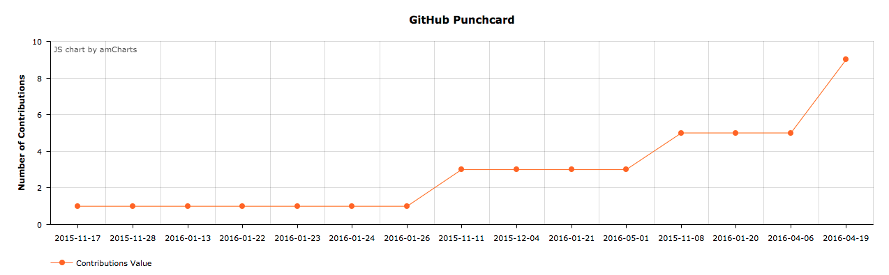

# githubPunchCard
> GithubPunchCard is used to display the contributions in a different
  telemetrics chart.

GithubPunchCard, It uses Selenium and goes to contribution webpage and scrapes
all the data which is later piped into a Dictionary. Dictionary is later sent to
a json file which is later on read by javascript to display on a WebPage.




## Installation

OS X & Linux:

```sh
Please refer Instructions
```

## Development setup
Install Node js on Mac:
http://blog.teamtreehouse.com/install-node-js-npm-mac

    brew install node
    node -v
    npm install http-server -g


## Release History
* 0.0.1
    * Work in progress

## Meta

Ripudaman Flora – flora_ripudaman@hotmail.com

Distributed under the MIT license. See ``LICENSE`` for more information.

[https://github.com/ardyflora/githubPunchCard](https://github.com/ardyflora/)
